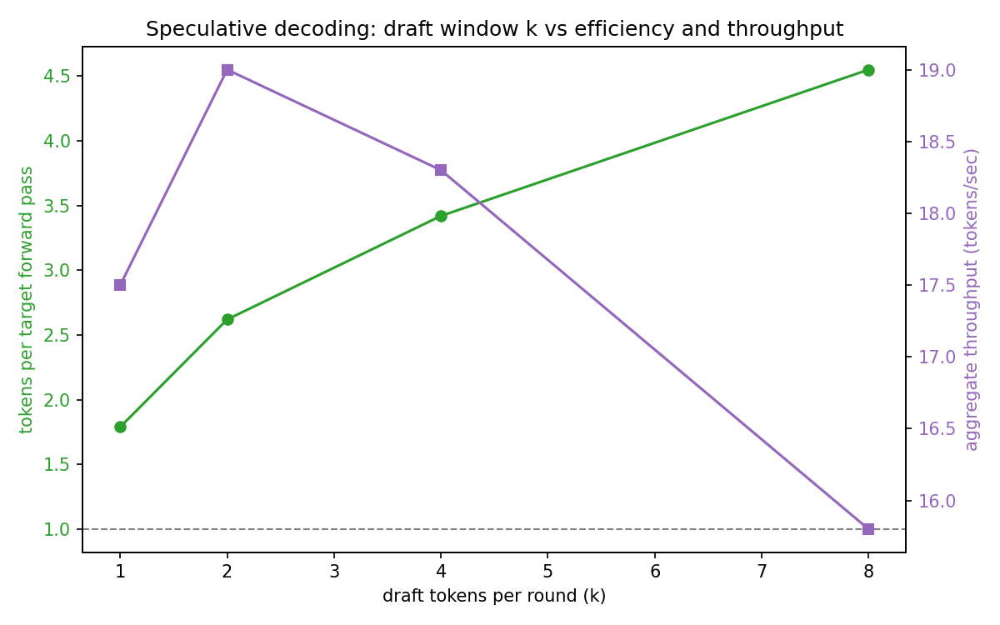
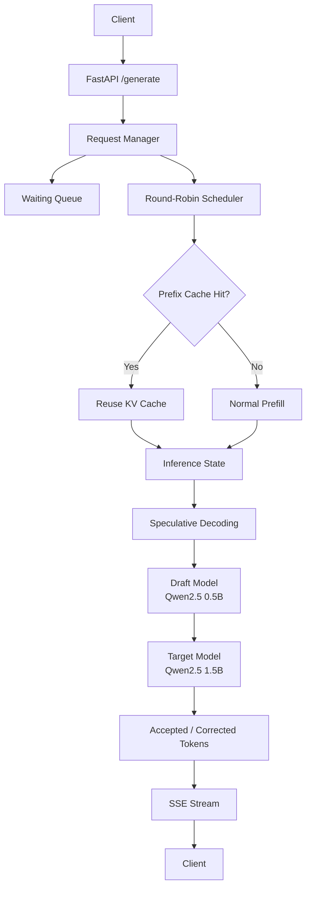

# Mini LLM Inference Server

A small experimental LLM inference server built to understand what happens **under the hood when a language model serves multiple requests**.

Instead of relying entirely on `model.generate()`, this project implements the main inference mechanisms manually and builds a lightweight serving layer around them:

* autoregressive decoding with KV caching
* asynchronous request scheduling
* token-level streaming over HTTP
* shared-prefix KV-cache reuse
* speculative decoding with a smaller draft model
* concurrent load testing and latency/throughput measurement

The project uses **Qwen2.5-1.5B-Instruct** as the target model and **Qwen2.5-0.5B-Instruct** as the speculative draft model.

> **Scope:** this is an educational/prototyping inference server, not a production replacement for systems such as vLLM or TensorRT-LLM.

---

## Why I built this

Calling an LLM with:

```python
model.generate(...)
```

hides most of the interesting inference machinery.

I wanted to understand the actual path of a request:

```text
HTTP Request
     │
     ▼
Request Queue
     │
     ▼
Scheduler
     │
     ├───────────────┐
     ▼               ▼
KV Cache        Speculative Draft
     │               │
     └───────┬───────┘
             ▼
       Target Model
             │
             ▼
       Generated Tokens
             │
             ▼
       SSE Streaming
             │
             ▼
          Client
```

The goal was not simply to make a model generate text, but to experiment with **how inference can be organized when several users request generation at the same time**.

---

# What is implemented

## 1. Manual autoregressive decoding

The first part of the project implements token generation without relying on Hugging Face's high-level generation loop.

The basic decode cycle is:

```text
Prompt
  │
  ▼
Prefill
  │
  ▼
KV Cache
  │
  ▼
Predict next token
  │
  ▼
Append token to cache
  │
  └──────► repeat
```

The model is initially run on the complete prompt. Subsequent decoding steps pass only the newly generated token together with the existing `past_key_values`.

This makes the role of the KV cache explicit rather than hiding it behind the generation API.

---

## 2. Streaming inference API

The model is exposed through a lightweight FastAPI server.

```http
POST /generate
```

Example request:

```json
{
  "prompt": "The capital of France is",
  "max_tokens": 20
}
```

Generated tokens are returned incrementally using **Server-Sent Events (SSE)**:

```text
data: Paris

data: , 

data: the

data: capital
```

This makes it possible to measure **time to first token (TTFT)** separately from total request latency.

---

# 3. Concurrent request scheduling

The baseline server handles each request independently.

I then added a small request manager with:

* a waiting queue
* a running-request set
* a configurable admission limit
* one asynchronous queue per request
* round-robin token generation

Conceptually:

```text
                 ┌── Request A ──► token
                 │
Waiting Queue ──►├── Request B ──► token
                 │
                 ├── Request C ──► token
                 │
                 └── Request D ──► token
```

Instead of allowing one long generation to completely occupy the server, the scheduler advances the active requests one step at a time.

### Important implementation detail

This project does **not** implement tensor-level continuous batching.

The scheduler interleaves requests at the iteration/token level, but the current implementation does not stack multiple independent requests into a single GPU forward pass.

That distinction matters because "continuous batching" is often used to describe much more sophisticated GPU batching systems.

---

# 4. Shared-prefix KV caching

Many real workloads contain requests with common prefixes.

For example:

```text
You are a helpful assistant. What is the capital of France?
You are a helpful assistant. What is the capital of Japan?
You are a helpful assistant. What is the capital of Germany?
                  └──────── shared prefix ────────┘
```

The server checks incoming prompts for a previously cached prefix.

If a matching prefix is found, its KV cache can be reused and only the remaining suffix needs to be processed.

The cache lookup searches for the longest matching cached prefix:

```text
prompt tokens
      │
      ▼
find longest cached prefix
      │
      ├── found ──► reuse KV cache
      │
      └── not found ──► normal prefill
```

The implementation also attempts to discover useful prefixes among waiting requests.

---

# 5. Speculative decoding



The project also experiments with **speculative decoding** using two models:

```text
Draft model
Qwen2.5-0.5B
       │
       │ propose k tokens
       ▼
Target model
Qwen2.5-1.5B
       │
       │ verify proposals
       ▼
accepted / corrected tokens
```

The smaller model generates a short sequence of candidate tokens.

The larger model then evaluates those candidates in a single verification pass.

If the target model agrees with the draft, several tokens can be accepted from one target-model verification step.

If a disagreement occurs, generation falls back to the target model's prediction at the appropriate position.

The implementation tracks:

* number of speculative rounds
* number of draft tokens
* number of accepted tokens
* accepted tokens per round
* target-model tokens produced per verification step

This makes it possible to investigate how the draft window `k` affects performance.

---

# 6. Combined inference path

The final experimental pipeline combines the two ideas:

```text
                 Incoming request
                        │
                        ▼
                 Prefix lookup
                   /       \
                hit         miss
                │             │
                ▼             ▼
          Reuse KV cache    Prefill
                │             │
                └──────┬──────┘
                       ▼
                Speculative decode
                       │
                ┌──────┴──────┐
                ▼             ▼
             accepted      corrected
                │             │
                └──────┬──────┘
                       ▼
                  SSE stream
```

This gives the project a useful progression:

```text
Manual decoding
      ↓
Streaming server
      ↓
Request scheduling
      ↓
Prefix KV caching
      ↓
Speculative decoding
      ↓
Combined pipeline
```

---

# Benchmarking

The repository contains a small asynchronous load-testing harness.

For a given concurrency level, multiple clients send requests simultaneously and the server records:

### Time to First Token (TTFT)

Time from sending the request until the first generated token is received.

### End-to-end latency

Time from request submission until generation finishes.

### Per-request throughput

Approximate generation rate for an individual request.

### Aggregate throughput

Total generated tokens divided by the wall-clock duration of the concurrent workload.

### Percentiles

Latency is reported using:

* p50
* p95
* p99

Percentiles are useful here because a server can have a reasonable average latency while still producing poor tail latency for some requests.

---

# Experiments

The code is structured so that different inference configurations can be compared under the same load-testing setup.

Examples include:

```text
Baseline
   │
   ├── single-request generation
   │
   ▼
Scheduler
   │
   ├── round-robin request scheduling
   │
   ▼
Combined pipeline
   │
   ├── prefix KV reuse
   └── speculative decoding
```

The speculative decoding experiment also varies the draft window:

```text
k = 1
k = 2
k = 4
k = 8
```

The interesting trade-off is that increasing `k` can increase the number of tokens proposed per target verification, but it also increases the amount of draft computation and may reduce the benefit when the draft model's predictions diverge from the target model.

---

# Example

A simple direct generation call:

```python
prompt = "The capital of France is"

output = list(
    generate_tokens(
        target_model,
        tokenizer,
        prompt,
        max_tokens=20
    )
)

print(
    tokenizer.decode(
        output,
        skip_special_tokens=True
    )
)
```

Speculative decoding can then be invoked with:

```python
output = list(
    speculative_generate(
        target_model,
        draft_model,
        tokenizer,
        prompt,
        k=4,
        max_tokens=20
    )
)
```

---

# Architecture

## Architecture

flowchart TD
    A[Client] --> B[FastAPI /generate]
    B --> C[Request Manager]

    C --> D[Waiting Queue]
    C --> E[Round-Robin Scheduler]

    E --> F{Prefix Cache Hit?}

    F -->|Yes| G[Reuse KV Cache]
    F -->|No| H[Normal Prefill]

    G --> I[Inference State]
    H --> I

    I --> J[Speculative Decoding]
    J --> K[Draft Model<br/>0.5B]
    K --> L[Target Model<br/>1.5B]
    L --> M[Accepted / Corrected Tokens]

    M --> N[SSE Stream]
    N --> O[Client]



```text
                    ┌──────────────────────┐
                    │      FastAPI API     │
                    └──────────┬───────────┘
                               │
                               ▼
                    ┌──────────────────────┐
                    │   Request Manager    │
                    │                      │
                    │ waiting / running    │
                    │ admission control    │
                    └──────────┬───────────┘
                               │
                    ┌──────────▼───────────┐
                    │      Scheduler       │
                    │   round-robin step   │
                    └──────────┬───────────┘
                               │
              ┌────────────────┼────────────────┐
              │                │                │
              ▼                ▼                ▼
        Prefix Cache      Draft Model      Target Model
              │                │                │
              │                └──────┬─────────┘
              │                       │
              └───────────────────────┤
                                      ▼
                              Generated tokens
                                      │
                                      ▼
                               SSE response
```

---

# Repository structure

```text
.
├── inference.ipynb
├── all_in_one.py
├── src/
│   ├── model_setup.py
│   ├── decode.py
│   ├── scheduler.py
│   ├── prefix_caching.py
│   ├── speculative_decoding.py
│   ├── combined_pipeline.py
│   ├── servers.py
│   ├── load_testing.py
│   └── plotting.py
├── assets/
│   ├── phase_comparison.png
│   ├── batch_size_sweep.png
│   └── draft_k_sweep.png
└── README.md
```

### `decode.py`

Manual autoregressive decoding with explicit KV-cache management.

### `scheduler.py`

Waiting/running request management and round-robin scheduling.

### `prefix_caching.py`

Shared-prefix detection and KV-cache reuse.

### `speculative_decoding.py`

Draft-and-verify speculative generation.

### `combined_pipeline.py`

Combines prefix reuse and speculative decoding.

### `servers.py`

FastAPI endpoints and SSE streaming.

### `load_testing.py`

Concurrent request generation and latency/throughput measurements.

### `plotting.py`

Visualization of benchmark results.

---

# Running the project

## Install dependencies

```bash
pip install torch transformers accelerate fastapi uvicorn httpx pandas matplotlib
```

## Load the models

The project uses:

```text
Qwen/Qwen2.5-1.5B-Instruct
Qwen/Qwen2.5-0.5B-Instruct
```

A CUDA-capable GPU is recommended because both models are loaded for inference.

## Run the notebook

The easiest way to explore the project is to run the notebook from top to bottom.

The notebook contains:

1. model loading
2. manual decoding
3. FastAPI baseline
4. request scheduler
5. prefix caching
6. speculative decoding
7. combined pipeline
8. load testing
9. benchmark visualization

---

# What I learned

The main takeaway from this project was that **LLM serving is a systems problem as much as a modeling problem**.

A model can generate tokens correctly, but serving many requests introduces additional concerns:

* how requests are admitted
* how GPU computation is shared
* how previous attention states are reused
* how generation is streamed
* how tail latency changes with concurrency
* when speculative decoding actually helps
* how much extra work an optimization introduces

The experiments also made an important distinction clear:

> **An optimization that reduces computation does not automatically improve end-to-end latency.**

Queueing, scheduling overhead, GPU utilization, memory movement, draft-model cost, and request concurrency can all affect the final result.

---

# Limitations

This project is intentionally small and educational.

It currently does **not** provide:

* tensor-level dynamic batching
* paged attention
* distributed inference
* tensor parallelism
* production-grade GPU memory management
* request cancellation
* persistent KV-cache storage
* authentication or rate limiting
* optimized CUDA kernels
* production observability

The prefix cache is also intentionally simple and in-memory.

These limitations are useful because they leave clear directions for extending the project.

---

# Possible extensions

Some natural next steps would be:

* implement actual tensor-level dynamic batching
* add request cancellation and timeouts
* introduce bounded KV-cache memory
* implement cache eviction policies such as LRU
* compare different draft models
* benchmark different speculative decoding window sizes
* add prompt-length and output-length sweeps
* measure GPU utilization and memory consumption
* compare against an optimized inference server
* add structured metrics and tracing

---

# Tech Stack

**Language**

* Python

**Model / ML**

* PyTorch
* Hugging Face Transformers
* Qwen2.5

**Serving**

* FastAPI
* Uvicorn
* Server-Sent Events

**Concurrency / Testing**

* asyncio
* httpx

**Analysis**

* pandas
* Matplotlib

---

## Project status

**Experimental / educational**

The project is primarily intended to explore the internals of LLM inference and serving rather than provide a production-ready inference framework.
        
